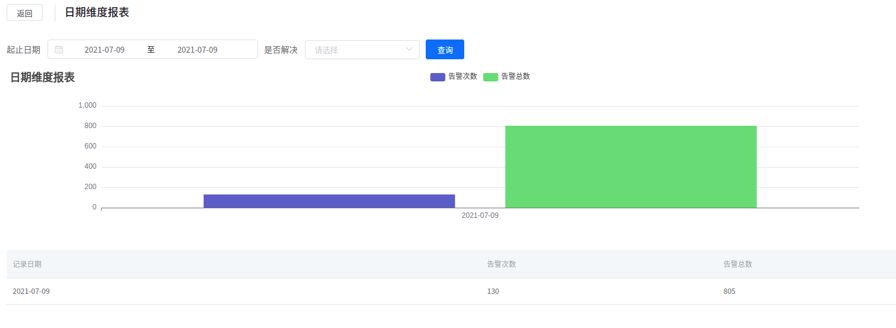

# EKLogMonitor说明


# 一、介绍

EKLogMonitor是基于Elasticsearch、Kibana及钉钉（及电话...）等平台及组件的关键字告警平台，支持不同团队不同应用的配置，支持根据不同的应用及团队分别设置不同的钉钉及电话告警接收组，可以及时发现线上的问题。

Elasticsearch、Kibana及EKLogMonitor各自的作用：

- Elasticsearch提供日志数据的存储及搜索功能；
- Kibana提供查询结果的展示；
- EKLogMonitor根据自定义的查询，定时从Elasticsearch中进行搜索，并判断是否满足告警条件，如果满足告警条件，则将当前告警保存到数据库中，并通过钉钉（及电话）及时的通知的用户。

# 二、架构介绍

架构如下所示：


其中红色框为EKLogMonitor的架构。

# 三、告警介绍

EKLogMonitor将告警通过钉钉发送给用户，用户可以直接通过钉钉点击告警的链接，该链接实际为包含当前告警查询条件Kibana链接，用户点击该链接就可以打开对应的Kibana执行查询，并能够看到与告警一致的查询结果信息，钉钉告警如下图所示：


跳击跳转链接，就可以跳到对应的Kibana页面，如下图所示：


注：

**电话告警**由于存在着一定的特殊性，每个使用方使用的渠道可能不一样，因而需要使用方单独实现，实现方法也很简单，已经留了足够的接口，用户只需要实现以下方法即可：

```java
com.eeeffff.monitor.eklogmonitor.alarm.phone.PhoneAlarmAction.phoneWarning(PhoneAlarmObj)
```

如果钉钉上的告警没有及时处理，用户还可以登陆到EKLogMonitor查看告警，并通过控制台跳转到对应的Kibana告警链接，如下图所示：


# 四、扩展告警

EKLogMonitor支持扩展新的告警，增加新的告警需要继承类com.eeeffff.monitor.eklogmonitor.alarm.AlarmAction，并实现其中的doAlarm及getOrder方法，如下图所示：


将实现类注册为Service或Component，即在类的头增加@Service或@Component注解，该类就会被框架自己发现，不需要用户做任何的配置，然后根据设置的Order值按顺序执行对应的告警。

# 五、应用配置及启动

## １、准备Redis

Redis不用做初使化，仅用于缓存，准备好可用的环境就行。

## ２、准备MySQL

MySQL需要执行建库建表的初使化，连上MySQL先创建数据库，操作如下：

```mysql
create database eklogmonitor default character set utf8;
```

然后进行入工程的src/main/resources/sql目录，通过如下命令进行数据库的导入：

```mysql
mysql -uroot -proot eklogmonitor < eklogmonitor.sql
```

## ３、application.yml配置

ELogMonitor需要使用到Redis及MySQL，需要在配置文件src/main/resources/application.yml中做好相应的配置，配置大致如下：

```yml
spring:
  redis:
    database: 0
    host: 127.0.0.1
    password: 
    port: 6379
    timeout: 2000
  aop:
    auto: true
    proxy-target-class: true
  datasource:
    dynamic:
      datasource:
        master:
          username: root
          password: root
          url: jdbc:p6spy:mysql://127.0.0.1:3306/eklogmonitor?useAffectedRows=true&useSSL=false&characterEncoding=utf8&zeroDateTimeBehavior=convertToNull&serverTimezone=Asia/Shanghai
          driver-class-name: com.p6spy.engine.spy.P6SpyDriver
          type: com.zaxxer.hikari.HikariDataSource
          initialSize: 5
          minIdle: 5
          maxActive: 20

app:
  monitor:
    es-url-list:

   - https://192.168.12.29:9200/
     -username: elastic
         es-password: NNAYUK28t37v6qD3haHk
         dd-webhook-url: https://oapi.dingtalk.com/robot/send?access_token=

    # 往钉钉发送消息的时候有频率限制，钉钉默认每分钟最多可以发送20条

​    dd-send-every-minute: 20

    # 系统执行监控的检查周期，单位为秒

​    task-interval-seconds: 60
​    kibana-template: http://192.168.12.29:5601/app/kibana#/discover?_a=(columns:!(_source),filters:!(('$state':(store:appState),meta:(alias:!n,disabled:!f,index:'${index}',key:query,negate:!f,type:custom,value:'${original_query}'),query:${query})),index:'${index}',interval:auto,query:(language:kuery,query:''),sort:!('@timestamp',desc))&_g=(filters:!(),refreshInterval:(pause:!t,value:0),time:(from:'${startTime}',to:'${endTime}'))
​    kibana-query-index-url: http://192.168.12.29:5601/api/saved_objects/_find?type=index-pattern&per_page=500

    # 根据部门配置需要额外接收电话告警的用户，Key为部门的ID，value的电话，多个电话以英文的逗号分隔

​    phoneAlertExtraUsers:
​      1 : 13255555555,13266666666,13277777777
```

## ４、编译工程

转到项目的根目录，执行install.sh。

## ５、运行工程

在项目的根目录，执行命令start.sh。

# 六、YAPI接口

YAPI接口参看目录src/main/resources/yapi_export_api中导出的YAPI接口定义。

# 七、管理界面

**ELogMonitor的管理界面，基于特殊的原因，暂时不能开源**，如果需要实现管理的功能，可参考以下截图实现。

## １、应用异常监控配置列表


## ２、新增异常监控配置


## ３、编辑异常监控配置


## ４、异常监控日期维度报表



## ５、异常监控项目部维度报表


## ６、异常监控应用维度报表


## ７、异常监控负责人维度报表


